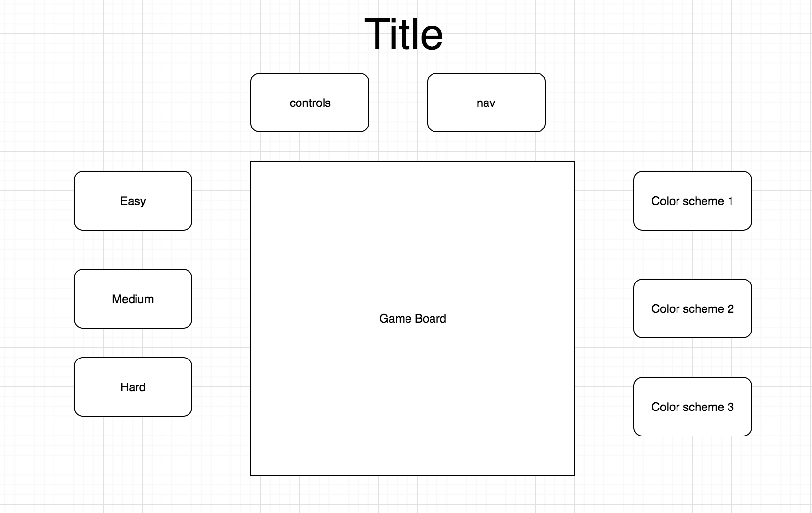

## Two Dots

### Background

Two Dots is a popular iPhone game and is the sequel to Dots.  The original Two Dots is a 1-player game that plays out on a rectangular grid.  Each dot on the grid can be a number of different colors.  The game is won via this process:

1) Hit the elimination quota for each dot type.

2) You eliminate dots by connecting them with at least one neighboring dot-- vertically or horizontally-- of the same color. \n

3) Rule # 2 can be chained (eg you can go up two dots then right 3 dots etc, **PROVIDED THAT** they are all the same color)

4) Special Rule: if you make a square of the same color, the whole board is removed of that color

There are many variations on the GoL.  This simulation will incorporate several of those variations, outlined in the **Functionality & MVP** and **Bonus Features** sections.

### Functionality & MVP

With this Two Dots clone, users will be able to:

- [ ] Start, pause, and reset the game board
- [ ] Select a color scheme
- [ ] Choose from preset levels
- [ ] Toggle between easy, medium, and hard grids with corresponding features

In addition, this project will include:

- [ ] An About modal describing the background and rules of the game
- [ ] A production Readme

### Wireframes

This app will consist of a single screen with game board, game controls, and nav links to the Github, my LinkedIn,
and the About modal.  Game controls will include Start, Stop, and Reset buttons.  On the left, three clickable buttons will be used to toggle between the difficulties available.  On the right, there will be three (or more) clickable gradient-filled rectangles used to toggle between color schemes (see Bonus Features).

### Architecture and Technologies

This project will be implemented with the following technologies:

- Vanilla JavaScript and `jquery` for overall structure and game logic,
- `Easel.js` with `HTML5 Canvas` for DOM manipulation and rendering,
- Webpack to bundle and serve up the various scripts.

In addition to the webpack entry file, there will be three scripts involved in this project:

`board.js`: this script will handle the logic for creating and updating the necessary `Easel.js` elements and rendering them to the DOM.

`game.js`: this script will handle the logic behind the scenes.  A Game object will hold a `difficulty` (easy, medium, or hard) and a 2D array of `Dot`s.  It will be responsible for validating moves on each `Dot` upon iteration and updating the `Dot` array appropriately.

`dot.js`: this lightweight script will house the constructor and update functions for the `Dot` objects.  Each `Dot` will contain a `difficulty` (easy, medium, or hard) and an `quotaState` (`integer array`).

### Implementation Timeline

**Day 1**: Setup all necessary Node modules, including getting webpack up and running and `Easel.js` installed.  Create `webpack.config.js` as well as `package.json`.  Write a basic entry file and the bare bones of all 3 scripts outlined above.  Learn the basics of `Easel.js`.  Goals for the day:

- Get a green bundle with `webpack`
- Learn enough `Easel.js` to render an object to the `Canvas` element

**Day 2**: Dedicate this day to learning the `Easel.js` API.  First, build out the `Dot` object to connect to the `Board` object.  Then, use `board.js` to create and render at least the easy grid, ideally all 3 grid types.  Build in the ability to replace the dots on move for each dot.  Goals for the day:

- Complete the `dot.js` module (constructor, update functions)
- Render a square grid to the `Canvas` using `Easel.js`
- Make each dot in the grid clickable, toggling the state of the board on click
- Do the same for medium and hard grids

**Day 3**: Create the dots logic backend.  Build out modular functions for handling the different grid types along with their unique neighbor checks and rule sets.  Incorporate the logic into the `Board.js` rendering.  Goals for the day:

- Export aa `Game` object with correct type and handling logic
- Have a functional grid on the `Canvas` frontend that correctly handles iterations from one generation of the game to the next

**Day 4**: Install the controls for the user to interact with the game.  Style the frontend, making it polished and professional.  Goals for the day:

- Create controls for level choice, stop, start, reset, and color scheme
- Have a styled `Canvas`, nice looking controls and title
- If time: include buttons on the side to toggle the color scheme of the dots

### Bonus features

There are many directions this Two Dots engine could eventually go.  Some anticipated updates are:

- [ ] Add options for different rule sets
- [ ] Add multiple choices for starting states that are interesting
