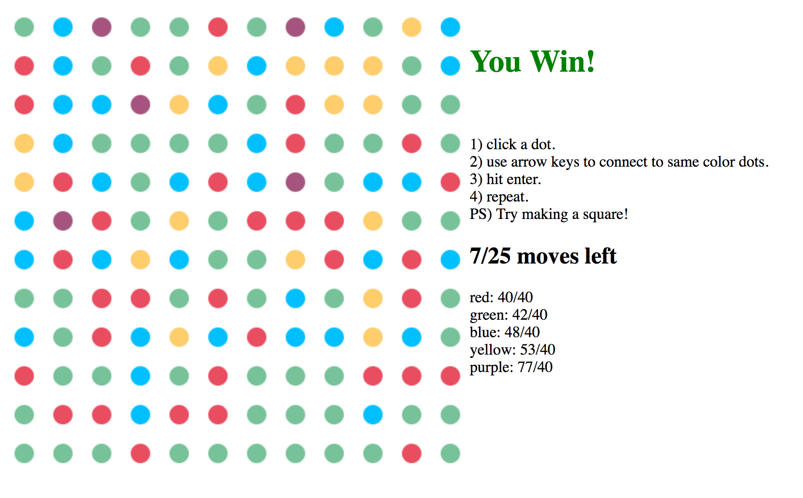

# TwoDots

[pages link]: rodeezy.github.io/TwoDots

TwoDots is an single-player pattern game. It is a web application, inspired by the popular iPhone game of the same name, and built using vanilla javascript with the EaselJs library.

## Features and Implementation

### The Dots

Dots are rendered with the EaselJs library and then stored and manipulated in a *grid* data structure for accessibility.

A radius of 10, spacing of 40, and a grid size of 12x12 ultimately was decided to be most appealing visually and practically.


#### The Color

The color palette is taken directly from the original game, for appealing and soothing vibes, dude.

### The Game

The instructions are stated just ambiguously enough to not be too confusing but also spark curiosity.

#### Gameplay

The user clicks on a dot to add it to a queue. When a start dot is picked, the user may use the arrow keys to navigate about the grid. A move is only legal if it is to a dot of the same color. Hit the removal quota for each color before moves run out, and you win! Otherwise, you lose!



##### Square Blast!
If a dot ends up in the queue twice (backtracing is prohibited), all the dots on the screen of selected color are removed from the board and added to your score!
(this is done by adding all unselected dots of selected color to the queue before dropping)

```javascript
prependToDrop(circle){
  if(this.dropQueue.includes(circle)){
    this.squareColor = this.color(circle);
  }
  else{
    this.dropQueue.unshift(circle);
  }
}
//...
gridAction(){
  if (this.squareColor){
    this.grid.forEach(row => row.forEach(circle => {
      if(this.color(circle) === this.squareColor){
          this.prependToDrop(circle);
      }
    }))
    //...
  }
}
```

## Future Directions for the Project

In addition to the features already implemented, I plan to continue work on this project. The next steps for TwoDots are outlined below.

### Styling

Make the instructions prettier and add a frame.

### Modes and Controls

Enable game modes, such as **colorblind**, and optional controls, such as play with mouse drag.
